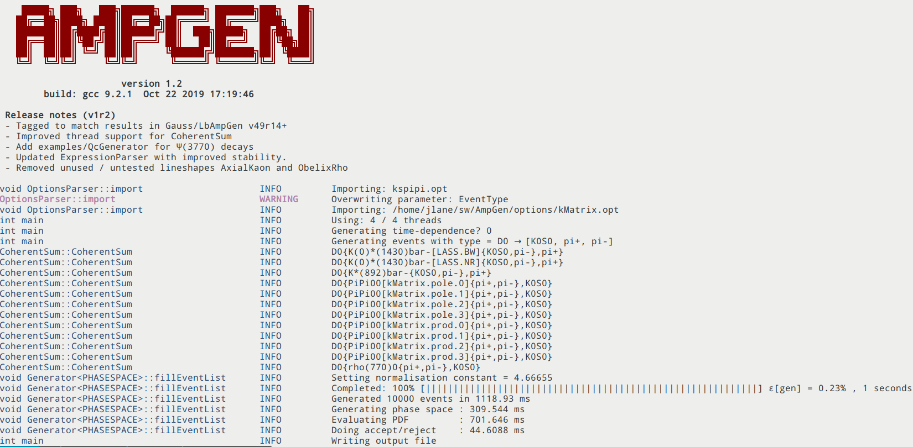
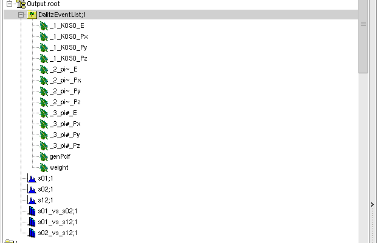
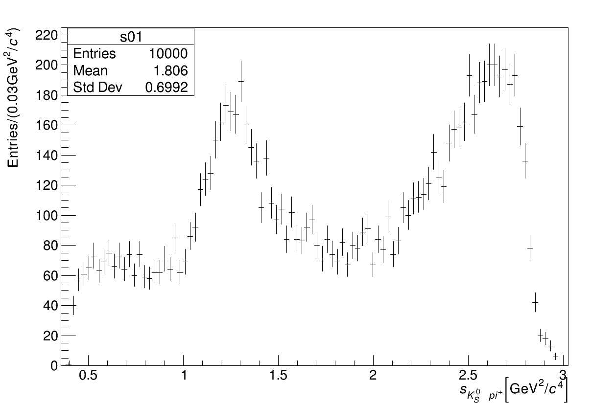
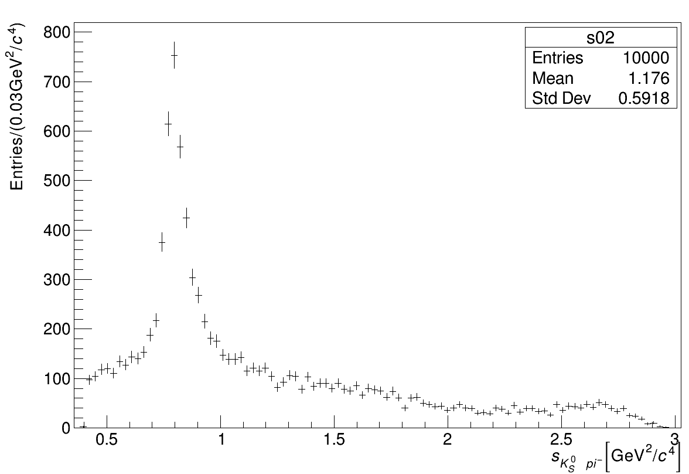
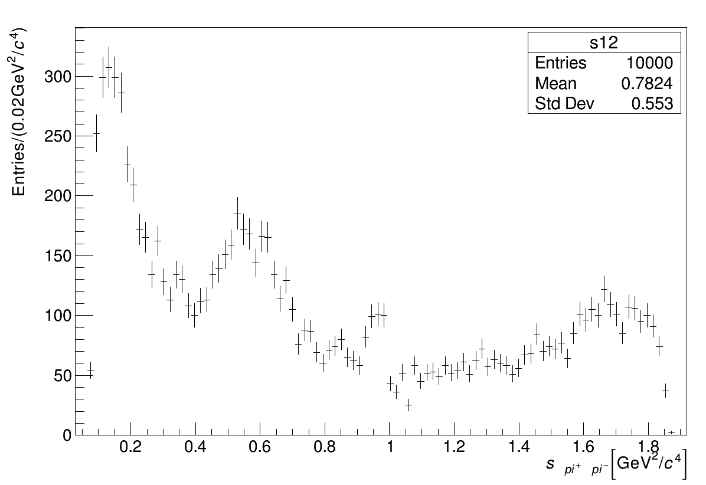
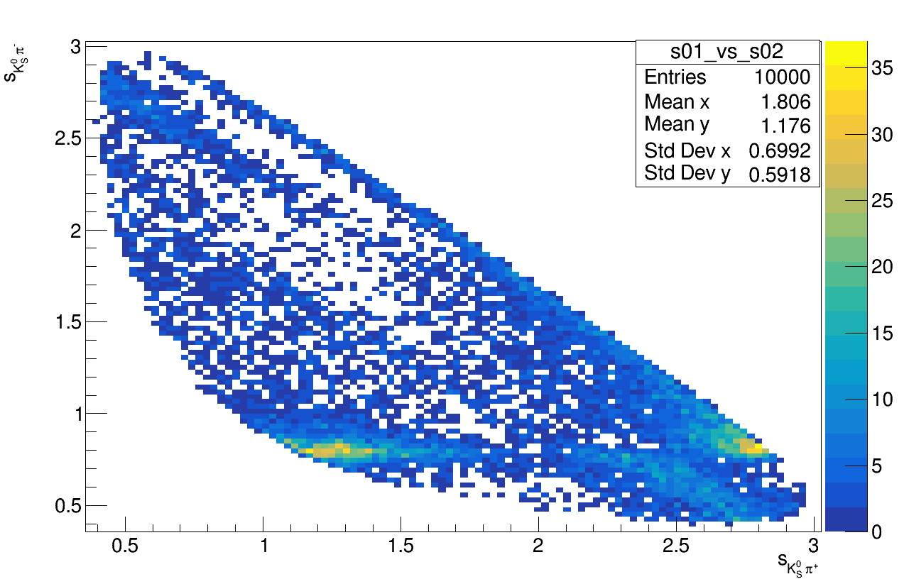
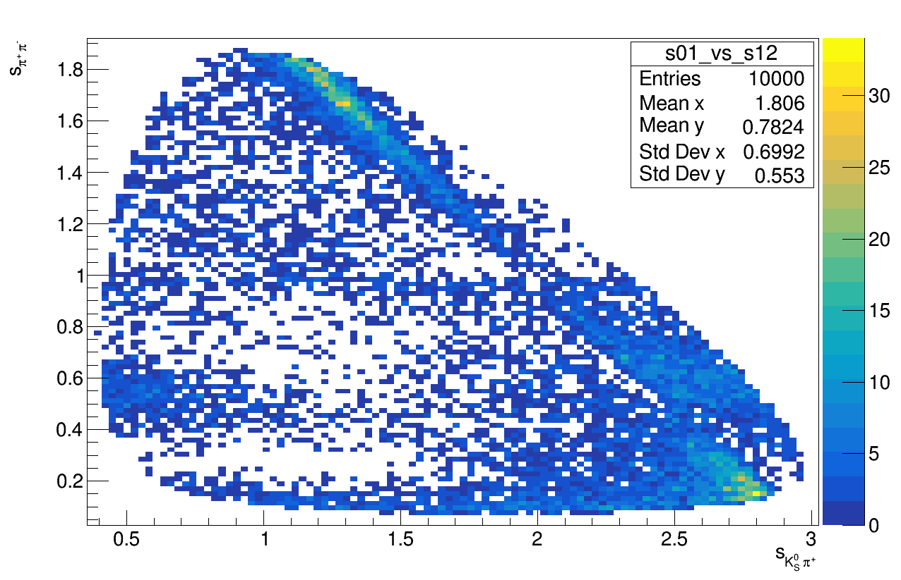
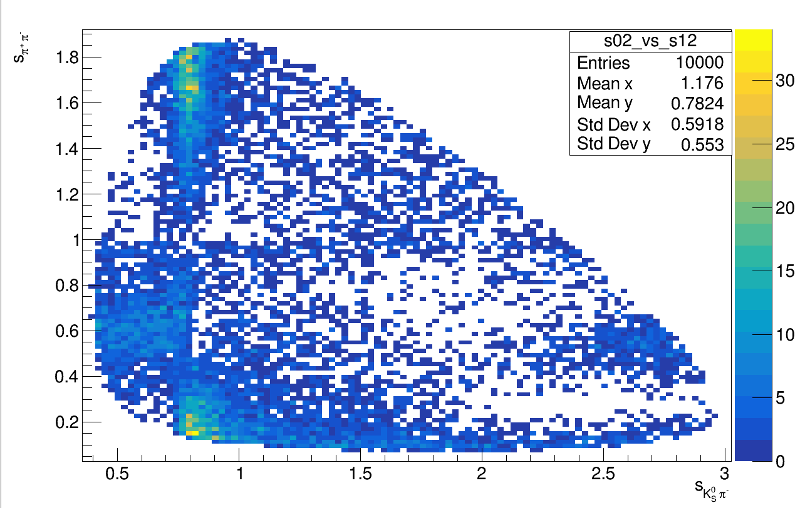

# Generating

To generate events we use the command `Generator`, which takes the arguments

```text
``--nEvents``, the number of events to generate (the default value is 1)

``--EventType``, the "type" of event in a string that describes the decay type, e.g. "D0 K0S0 pi- pi+" describes $`D^0 \to K_S^0 \pi^+ \pi^-`$

``--Output``, the ROOT file to output the tuple of generated events

``--Seed``, the seed for the random number generator in `AmpGen`, it is 0 by default but should be changed for pull studies.
```

We must also define our amplitude model \(as seen in the [Amplitude Lesson](https://github.com/jakelane137/AmpGen-Manual/tree/68f50813c5d1fda0b1a951fb7178a665a883a952/lessons/02-Generating/lessons/02-Amplitudes/02-Amplitudes.md)\)

In our example let's generate 10,000 $$D^0 \to K_S^0 \pi^+ \pi^-$$ events and save them as `Output.root` using the options file called `kspipi.opt`

```text
Generator --Output Output.root --EventType "D0 K0S0 pi- pi+" --nEvents 10000 --Seed $RANDOM kspipi.opt
```

note that we have also used the `bash` variable `$RANDOM` to ensure the seed is different each time we run this command, otherwise every time we will generate identical sets of events.

The output from the above command should look like



We can examine the `ROOT` file with `TBrowser`, which should show the structure of the output file



`Generator` will automatically produce histograms for the Dalitz variables \(in 1D and 2D\)



$$m_{K_S^0\pi^-}$$



$$m_{K_S^0\pi^+}$$



$$m_{\pi^+ \pi^-}$$



$$m_{K_S^0\pi^-}$$ vs $$m_{K_S^0\pi^+}$$



$$m_{K_S^0\pi^-}$$ vs $$m_{\pi^+\pi^+}$$



$$m_{K_S^0\pi^+}$$ vs $$m_{\pi^+\pi^+}$$

