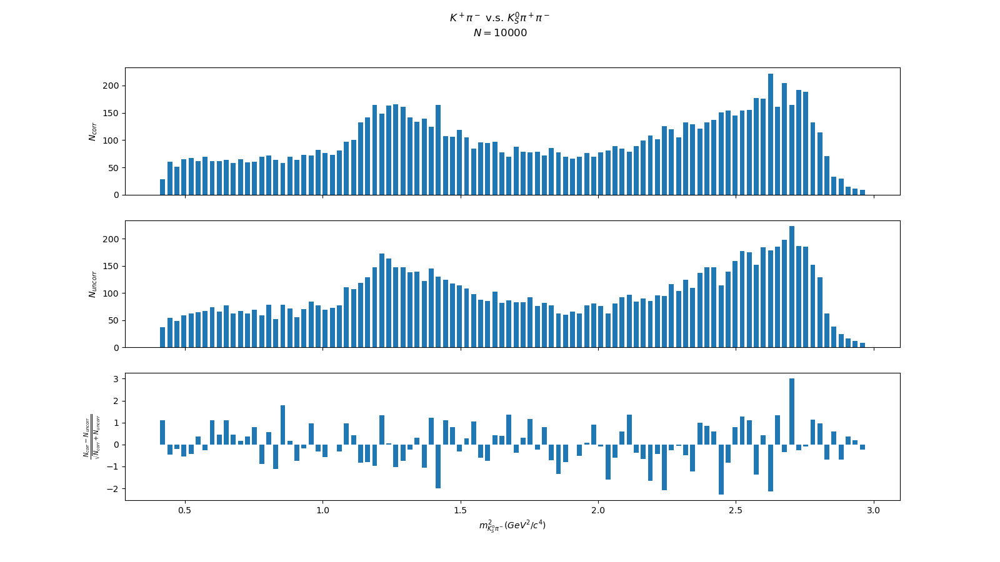
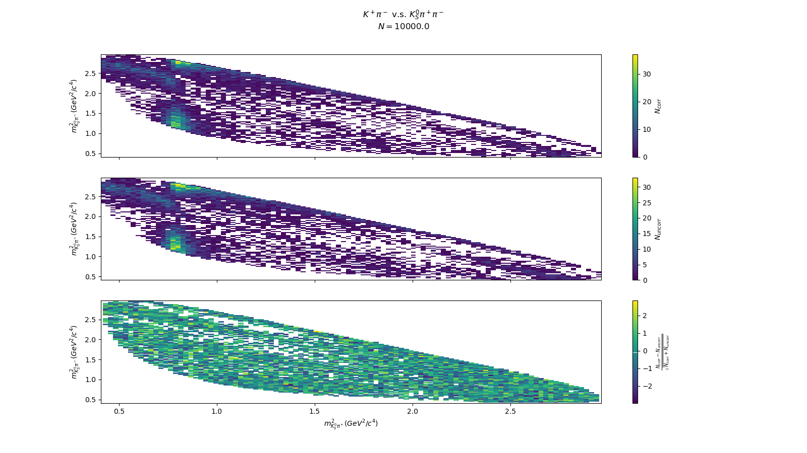
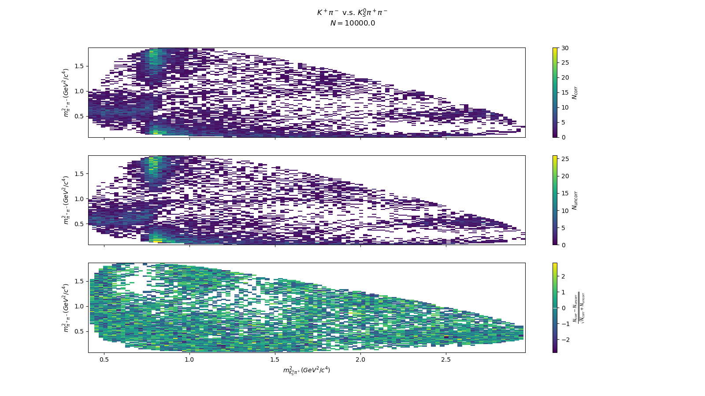
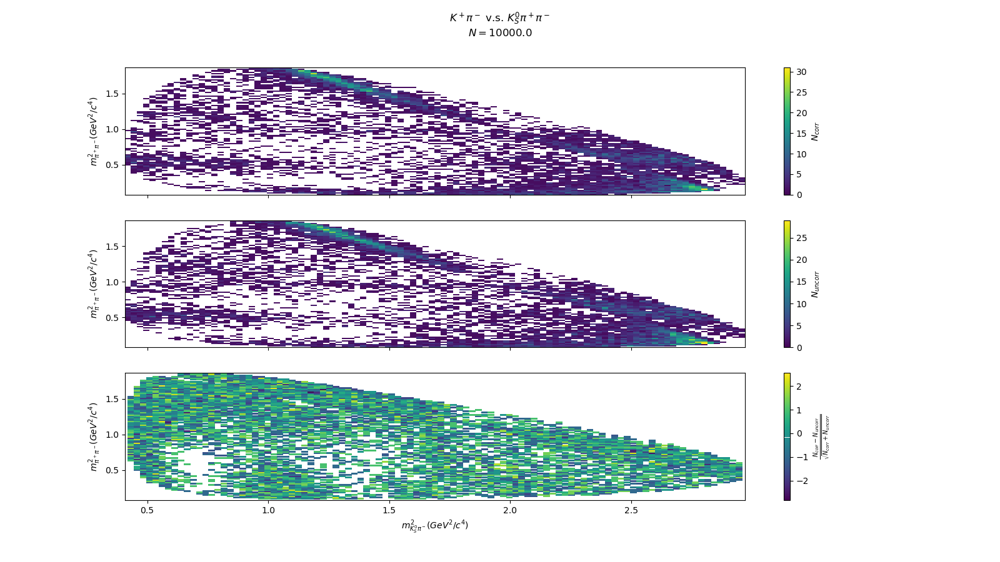

# Correlated Methods

## Quantum Correlated Amplitudes

At experiments such as `BESIII`, we collide $$e^+ e^-$$ at "resonances" e.g. $$e^+ e^- \to \psi(3770)$$ at $$\sqrt{s}=3.773 GeV$$. We then see the decay

$$
\psi(3770) \to D^0 \bar{D}^0
$$

with a branching fraction of 52%.

The two $$D$$ mesons are formed in a "correlated" state

$$
|\psi(3770)\rangle = \frac{1}{\sqrt{2}}(|D^0\rangle - |\bar{D}^0\rangle)
$$

the minus sign is due to the odd parity of the $$\psi(3770)$$ state.

Therefore the amplitude, $$\mathcal{A}(\psi(3770) \to D^0 \bar{D}^0)$$ will be of the form

$$
\mathcal{A}(\psi(3770) \to D^0 \bar{D}^0) = \frac{1}{\sqrt{2}} (\mathcal{A}(D^0 \to f_{1})\mathcal{A}(\bar{D}^0 \to f_{2}) - \mathcal{A}(\bar{D}^0 \to f_{1}) \mathcal{A}(D^0 \to f_{2}))
$$

where $$f_{1,2}$$ are two final states that the $$D^0 \bar{D}^0$$ decay into.

## AmpGen

In order for `AmpGen` to use these "Correlated" amplitudes, we use the `CorrelatedSum` object in `AmpGen`. Currently this object is only available in the `jlane` branch of `AmpGen`, so using our installation of `AmpGen` we will switch to that branch and rebuild `AmpGen`.

`cd` to the `AmpGen` directory

```text
cd $AMPGENROOT
```

checkout the `jlane` branch

```text
git checkout jlane
```

`cd` to the `install` directory

```text
cd $AMPGENROOT/install
```

run `make clean` to clean up the installation directory

```text
make clean
```

run `cmake` to prepare the directory for compilation

```text
cmake --DCMAKE_CXX_STANDARD=17 ..
```

then run `make`

```text
make -j10
```

You will see some warnings regarding "unused variables" but these are fine, remember that "Quantum Correlation" in `AmpGen` is a work in progress!

If you now look in `$AMPGENROOT/install/bin` you will find some new binaries, `QcGenerator`, `QcGen2` and `QcFitter`. These programs \(as their name suggests\) generate quantum correlated events \(`QcGenerator` and `QcGen2`\) and fit them \(`QcFitter`\).

## Generating correlated events

We will use `QcGen2` for our example, since the program is faster and closer in functionality to the "uncorrelated" `Generator` program. We will, again, use the decay $$D \to K_S^0 \pi^+ \pi^-$$.

We will use the following decay $$D^0 \to K_S^0 \pi^+ \pi^-$$ v.s. $$\bar{D}^0 \to K^+ \pi^-$$, where we will expect only $$D^0 \to K_S^0 \pi^+ \pi^-$$ events and no $$\bar{D}^0 \to K_S^0 \pi^+ \pi^-$$. to test our correlated generator.

To generate events, as with `Generator` we will supply the `EventType`, `nEvents` and `Output` to `QcGen2` as well as an "options" file. As we cannot just use the original options file from the [generator lesson](02-generating.md).

We need to provide information about the "tag" decay as well as the "signal" decay \(which is specified by the `EventType`\), the file `Kspipi_vs_Kppim.opt` is as follows:

```text
EventType D0 K0S0 pi- pi+
nCores 10
makeCPconj true
Import kspipi.opt
TagTypes  {
    "Kppim       D0{K+,pi-}"
}
D0{K+,pi-}_Re 2 0 0
D0{K+,pi-}_Im 2 0 0
Dbar0{K+,pi-}_Re 2 1 0
Dbar0{K+,pi-}_Im 2 0 0
```

now we run

```text
QcGen2 --EventType "D0 K0S0 pi- pi+" --Output "Kspipi_vs_Kppim.root" --nEvents 10000 Kspipi_vs_Kppim.opt
```

this will produce a file `Kspipi_vs_Kppim.root`, which has two `TTrees` called `Signal` and `Tag`. We now have, as with the uncorrelated case, projection plots of the "Signal" event. We can use `ROOT` tools or \(my preference\) `uproot` to compare these projections. Remember we have explicity chosen our tag such that we reproduce only $$D^0 \to K_S^0 \pi^+ \pi^-$$ events.

If one runs

```text
python3 compare.py
```

one will see the following plots.


Projection of $$m^2_{K_S^0\pi^-}$$



Projection of $$m^2_{K_S^0\pi^+}$$


Projection of $$m^2_{\pi^+pi^-}$$



Projection of $$m^2_{K_S^0\pi^-}$$ v.s. $$m^2_{K_S^0\pi^+}$$



Projection of $$m^2_{K_S^0\pi^-}$$ v.s. $$m^2_{\pi^+\pi^-}$$



Projection of $$m^2_{K_S^0\pi^+}$$ v.s. $$m^2_{\pi^+\pi^-}$$

Hopefully you can see that we have pulls \(mostly\) within $$\pm 1 \sigma$$ which shows that we are indeed reproducing the correlated case!

## A more interesting example

Let's use a more creative example, instead of a flavour tag, let's use a CP tag : $$D \to K^+ K^-$$, which is a $$CP=+1$$ eigenstate, therefore the "other side" $$D \to K_S^0 \pi^+ \pi^-$$ will have be in a $$CP=-1$$ eigenstate \(assuming no $$CP$$ violation of course!\).

To run this we repeat the command that generated the correlated sample but with a different options file

```text
QcGen2 --EventType "D0 K0S0 pi- pi+" --Output "Kspipi_vs_KK.root" --nEvents 10000 Kspipi_vs_KK.opt
```

this will produce a file `Kspipi_vs_KK.root`

