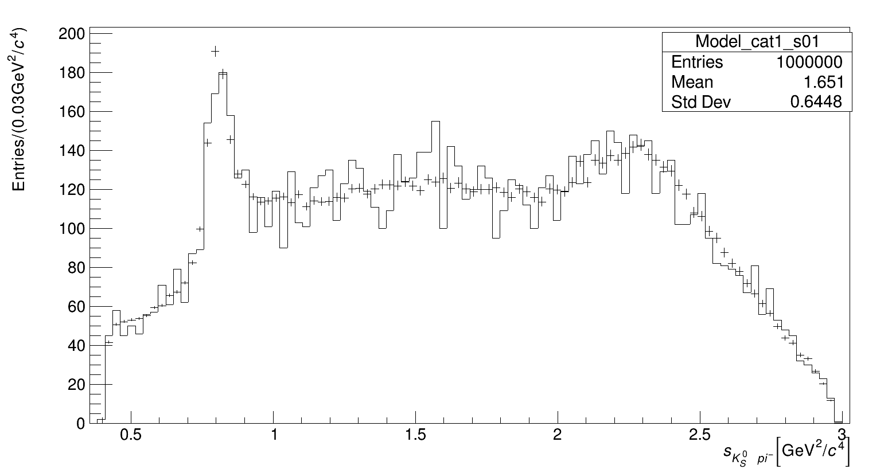
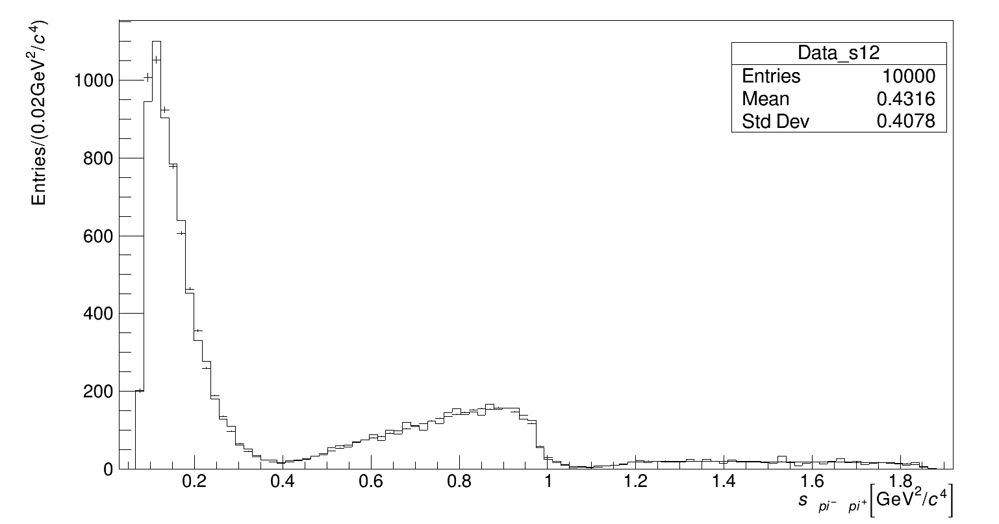

Fitting with AmpGen
===================

Now that we can generate events with `AmpGen`, we can fit these events with a given model. `AmpGen` offers a few fitting programs, for simplicity we will use the simplest one, `SignalOnlyFitter` which (as the name suggests) only fits "Signal" events (as opposed to "Signal + Background" which we see in real experiments).

`SignalOnlyFitter` uses the arguments
    - "--DataSample" , the input data sample
    - "--IntegrationSample" (optional), a set of events (in the same format as the data sample) used to normalise the fitting pdf and to produce projections
    - "--EventType", as with `Generator` `AmpGen` needs to know what type of decay is being used
    - "--Plots", the location for the `ROOT` file that contains the projections of the fit
    - "--LogFile", the location for the "logfile" that contains the results of the fit (including the values of the fitted parameters and their covariance matrix, the fit quality, fit fractions and $`\chi^2`$)

If one does not provide an integration sample to `SignalOnlyFitter`, `AmpGen` will generate one for us, but we will generate a flat sample since it is very quick and it allows us to control the size of the integration sample.

the command 

`Generator --nEvents 1000000 --EventType "D0 K0S0 pi- pi+" --Output flat.root --Seed $RANDOM flat.opt`
will generate our "flat" integration sample with 1000000 events

We will generate our data sample with `Generator` 

``Generator --nEvents 10000 --EventType "D0 K0S0 pi- pi+" --Output data.root --Seed $RANDOM data.opt``

then to fit our data with our model

``SignalOnlyFitter --Seed $RANDOM --EventType "D0 K0S0 pi- pi+"" Plots plots.root --LogFile fit.log --DataSample data.root --IntegrationSample flat.root model.opt``

this will fit ``data.root`` with our ``model.opt`` values and output the fit log to ``fit.log`` and the projections to ``plots.root``

In the file, ``plots.root``, we see two sets of distributions of the Dalitz variables in our decay.


We can see, by eye, how good our fit is by comparing the fitted distribution to the distributions from data, (the crosses are the fitted values and the line is the data).





To get quantitative data on the fit quality, we look at the ``fit.log``, where we find entries such as 

```
Parameter D0{K(0)*(1430)+[GLASS]{K0S0,pi+},pi-}_Re Free 0.0231752 0.0104443 0 0.000109084 -2.09326e-06 -4.16102e-05 -7.72944e-07 5.05097e-05 -4.53138e-05 0.000142131 -0.000225132 6.24424e-05 -5.8438e-05 0.000175664 -0.000370854 -0.000466275 -0.000399183 -9.54232e-05 -1.61708e-05 0.000343005 0.000332242 0 0 0.000208166 -0.000571366 8.11779e-05 -2.47986e-05 0.000616948 0.000157744 0 0 0 0 0 0 0 0 0 0 0 0 0 0 0 0 0 0 0 0 0 0 0 0 0 0 0 0 0 0 0 0 0 0 0 0 0 0 0 0 0 0 0 0 0 0 0 0 0 -4.43162e-05 1.35353e-05 4.41546e-05 0.000252553 -0.00103935 0.00256364 -0.000610976 0.00027078 0.000224415 -0.000302931 7.58553e-06 -0.000385608 -4.38598e-05 -0.00192184 0 0 0 0 0 0 0 0 0 0 0 0 0 0 0 0 0 0 0 0 0 0 0 0 0 0 0 0 0 
```
which translates to 

```math
\Re(a(D^0 \to K_0^*(1430)^+ \pi^-)) = 0.0231752 \pm 0.0104443
```

The line 

```
FitQuality 471.85207 512 38 -18818.676 0
```

gives the "Fit Quality", in this case we have
```math
\chi^2 = 471.85207 \\
N_{bins} = 512 \\
N_{params} = 38 \\
-2\log\mathcal{L} = -18818.676
```
The number of degrees of freedom is given by
$$
N_{dof} = N_{bins} - N_{params} - 1
$$

so we have a $`\chi^2/N_{dof} = 0.9976`$, which is close to 1 (as expected!)


