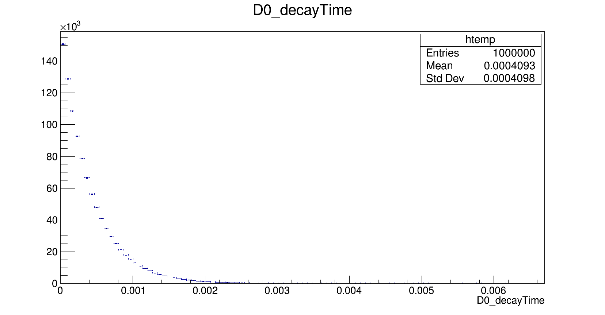

Time Dependence in ``AmpGen``
=============================

Generation
----------

In ``AmpGen``, we can simulate the time dependence of a decay by using the option
```
GenerateTimeDependent true
```

we also need to set a mean lifetime, $$\tau$$, for our $$D^0$$ meson, which we do with the option.
``AmpGen`` uses $$ns$$ as a unit for time, so we will use the PDG values for the $$D^0$$ lifetime.

```
D0_decayTime Free 410.1e-6 1.5e-6
```

note that we can set this parameter to be "Free" and thus we can fit our decay time just like any other variable in AmpGen

so if we use the same command as in the generation lesson

```
Generator --nEvents 100000 --EventType "D0 K0S0 pi- pi+" --Output Kspipi.root Kspipi.opt
```

which will produce the file, ``Kspipi.root`` which will have a new entry in the ``TTree``, ``DalitzEventList``




Fitting
-------

Since the only difference between the "time-independent" and "time-dependent" fit is the presence of another variable in the event, there is no need to do anything extra as far as ``AmpGen`` is concerned.

So we perform the same command as before with our ammended options file

```
SignalOnlyFitter --DataSample Kspipi.root --IntegrationSample Flat.root --EventType "D0 K0S0 pi- pi+" --Plots plots.root --LogFile fit.log kspipi.opt
```


